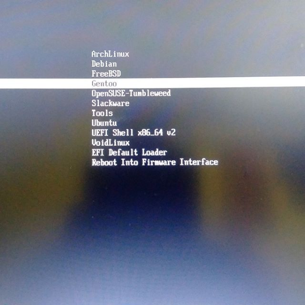

# UEFI_Linux_Boot_Process_From_Userland

First and foremost thing, go to your BIOS and trun on/select booting from UEFI option.

Booting Linux from UEFI environment as well creating the environment.
This is an attempt to let you familier with the UEFI booting requirement for Linux.

Few basic things first, Please create a FAT formatted EFI partition .

Then, please create a efi directory in /boot directory then mount the EFI partition on it .

To make it more consistent, please put an entry in /etc/fstab like this :

UUID="83BB-469F"  /boot/efi       vfat    umask=0077      0       1

OR

/dev/EFI_Partition  /boot/efi       vfat    umask=0077      0       1

Please change the "EFI_Partiton" to actual partition number , that might /dev/sda1 or /dev/sda2 

The .conf files for the specific OS has to reside in the /boot/efi/loader/entries directory and it looks like this :

ArchLinux.conf  Debian.conf  Gentoo.conf  Opensuse.conf  Slackware.conf  Tools.conf  UEFI-shell.conf

There is also a "loader" directory under /boot/efi/ , which consist a file called "loader.conf"

timeout 5

default Gentoo

console-mode keep

This is bare minimal. You can replace the OS of your choice in the default entry, so , the curson will always place on it.
 

Here is how the EFI folder content looks like , which reside in /boot/efi/  ...basically holding the kernel and initrd images

ArchLinux      Boot   debian      Gentoo      goofiboot  opensuse.nsh  Shell.efi  slackware.nsh  tools
archlinux.nsh  certs  debian.nsh  gentoo.nsh  opensuse   refind    slackware  

Now if I entereed any of those OS directory  , the content will be like this :

initramfs-ArchLinux-5.8.14.img  vmlinuz-ArchLinux-5.8.14

So, basically if the building mechanism of kernel not putting the kernel image and initrd image in the specific direcotry in EFI(I believe modern distros does put in)
, then you have to manually put those two files in that specific(OS dir) under EFI folder.

Install "efibootmgr" package/software in your computer to see the thing about UEFI stuff from command line , and also to create boot entry in the UEFI directory.

Here is how it look like , when you fire the "efibootmgr" from cli with the -v option:

efibootmgr -v

BootCurrent: 0013

Timeout: 0 seconds

BootOrder: 0013,0016,0014,0015,0009,0004,0007,0008,000A,000B,000C,0012

Boot0000  Setup FvFile(721c8b66-426c-4e86-8e99-3457c46ab0b9)

Boot0001  Boot Menu     FvFile(126a762d-5758-4fca-8531-201a7f57f850)

Boot0002  Diagnostic Splash Screen      FvFile(a7d8d9a6-6ab0-4aeb-ad9d-163e59a7a380)

Boot0003  Lenovo Diagnostics    FvFile(3f7e615b-0d45-4f80-88dc-26b234958560)

Boot0004  Startup Interrupt Menu        FvFile(f46ee6f4-4785-43a3-923d-7f786c3c8479)

Boot0005  Rescue and Recovery   FvFile(665d3f60-ad3e-4cad-8e26-db46eee9f1b5)

Boot0006  MEBx Hot Key  FvFile(ac6fd56a-3d41-4efd-a1b9-870293811a28)

Boot0007* USB CD        VenMsg(bc7838d2-0f82-4d60-8316-c068ee79d25b,86701296aa5a7848b66cd49dd3ba6a55)

Boot0008* USB FDD       VenMsg(bc7838d2-0f82-4d60-8316-c068ee79d25b,6ff015a28830b543a8b8641009461e49)

Boot0009* ATA HDD0      VenMsg(bc7838d2-0f82-4d60-8316-c068ee79d25b,91af625956449f41a7b91f4f892ab0f600)

Boot000A* ATA HDD1      VenMsg(bc7838d2-0f82-4d60-8316-c068ee79d25b,91af625956449f41a7b91f4f892ab0f601)

Boot000B* ATA HDD2      VenMsg(bc7838d2-0f82-4d60-8316-c068ee79d25b,91af625956449f41a7b91f4f892ab0f602)

Boot000C* USB HDD       VenMsg(bc7838d2-0f82-4d60-8316-c068ee79d25b,33e821aaaf33bc4789bd419f88c50803)

Boot000D* PCI LAN       VenMsg(bc7838d2-0f82-4d60-8316-c068ee79d25b,78a84aaf2b2afc4ea79cf5cc8f3d3803)

Boot000E* IDER BOOT CDROM       PciRoot(0x0)/Pci(0x16,0x2)/Ata(0,1,0)

Boot000F* IDER BOOT Floppy      PciRoot(0x0)/Pci(0x16,0x2)/Ata(0,0,0)

Boot0010* ATA HDD       VenMsg(bc7838d2-0f82-4d60-8316-c068ee79d25b,91af625956449f41a7b91f4f892ab0f6)

Boot0011* ATAPI CD      VenMsg(bc7838d2-0f82-4d60-8316-c068ee79d25b,aea2090adfde214e8b3a5e471856a354)

Boot0012* PCI LAN       VenMsg(bc7838d2-0f82-4d60-8316-c068ee79d25b,78a84aaf2b2afc4ea79cf5cc8f3d3803)

Boot0013* Linux Boot Manager    HD(3,GPT,0c5344f1-db24-4668-aef2-9f007e93caac,0x3ff4a800,0x200000)/File(\EFI\goofiboot\goofibootx64.efi)

Boot0014* elilo HD(3,GPT,0c5344f1-db24-4668-aef2-9f007e93caac,0x3ff4a800,0x200000)/File(\EFI\Boot\elilo-x86_64.efi)

Boot0015* EFIBoot       HD(3,GPT,0c5344f1-db24-4668-aef2-9f007e93caac,0x3ff4a800,0x200000)/File(\EFI\Boot\BOOTX64.EFI)

Boot0016* rEFInd Boot Manager   HD(3,GPT,0c5344f1-db24-4668-aef2-9f007e93caac,0x3ff4a800,0x200000)/File(\EFI\refind\refind_x64.efi)

# You can create direct boot entry by efibootmgr 

efibootmgr -c -d /dev/sda -p 1 -L "Arch Linux" -l '\EFI\arch\vmlinuz-arch.efi' -u root=/dev/sda3 ro initrd=EFI/arch/initramfs-arch.img

Change the disk and partition as per your requirement.

# Install Grub to the efi partition to use it

grub-install --target=x86_64-efi --efi-directory=/boot/efi --bootloader-id=gentoo --recheck --no-floppy --debug

# Boot screen look like this :

